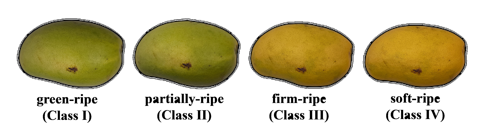

# Ataulfo Mango Maturity Dataset and Reproducible Code

<p align="center">
  
</p>

<p align="center">
  <em>Representative visual appearance of Ataulfo mango samples across different maturity stages.</em>
</p>

<<p align="center">
<!--
  <a href="https://www.python.org/">
    
  </a>
  <a href="https://opencv.org/">
    
  </a>
  <a href="https://www.tensorflow.org/">
    
  </a>
  <a href="https://pytorch.org/">
    
  </a>
  -->
  <a href="https://github.com/Imanol-24/ataulfo-mango-maturity-dataset/releases/tag/v1.0.0">
    
  </a>
  <a href="#citation">
    
  </a>
</p>

This repository provides an **Ataulfo mango dataset for maturity classification**, together with quantitative feature datasets in CSV format and reproducible code for image segmentation, feature extraction, MLP classification, and pretrained deep learning models.

The objective of this repository is to allow researchers to use the dataset, verify the experimental workflow, or use the provided code as a basis for new methods.

> **Citation notice**
>
> If you use the image dataset, CSV feature datasets, source code, models, scripts, or any derived resource from this repository, please cite the associated paper.
>
>
> Complete citation information will be updated once the article is formally published.

---

## Repository Contents

| Folder | Description |
|---|---|
| `data/` | Contains tabular feature datasets and, optionally, a small image sample. The complete image dataset is downloaded from GitHub Releases. |
| `segmentation/` | Image segmentation scripts using HSV, LAB, HSI color models and Otsu and Kapur thresholding techniques. |
| `feature_extraction/` | Color and texture feature extraction scripts, including GLCM and LBPriu2 descriptors. |
| `mlp_classification/` | MLP classification code using extracted quantitative features and hyperparameter search. |
| `pretrained_models/` | Code for pretrained image classification models such as MobileNetV2, MobileNetV3, and ResNet18. |
| `outputs/` | Folder reserved for outputs generated by the scripts. |
| `assets/` | Images and visual resources used in the README. |

---

## Dataset Description

The dataset contains Ataulfo mango images organized by maturity class. The dataset is **not provided with predefined training, validation, or test splits**, so that each user can define their own experimental protocol.

In addition to the images, CSV files with previously extracted quantitative features are included. These files allow users to work directly with classical machine learning models without necessarily repeating the segmentation and feature extraction stages.

---

## Full Dataset Download

The complete image dataset is not stored directly inside the Git repository because of its size.

The complete image dataset is available in the GitHub Releases section:

https://github.com/Imanol-24/ataulfo-mango-maturity-dataset/releases/tag/v1.0.0


---

## Installation

Clone the repository:

```bash
git clone https://github.com/Imanol-24/ataulfo-mango-maturity-dataset.git
cd ataulfo-mango-maturity-dataset
```

Install the required dependencies:

```bash
pip install -r requirements.txt
```

Depending on your environment, **TensorFlow** and **PyTorch** may require CPU- or GPU-specific installations.

---

## Image Segmentation

The `segmentation/` folder contains segmentation programs for:

- HSV, LAB, and HSI segmentation
- Otsu thresholding
- Kapur thresholding

Examples:

```bash
python segmentation/segmentacion_hsv_lab_hsi.py
python segmentation/segmentacion_otsu_kapur.py
```

---

## Feature Extraction

The `feature_extraction/` folder contains scripts to extract:

- Color features from RGB, Lab, and HSV
- GLCM texture features
- LBPriu2 texture features

Examples:

```bash
python feature_extraction/extraccion_caracteristicas_color.py
python feature_extraction/extraccion_glcm.py
python feature_extraction/extraccion_lbpriu2.py
```

---

## MLP Classification

The `mlp_classification/` folder contains the hyperparameter search and MLP training code using tabular features.

Example:

```bash
python mlp_classification/train_mlp.py --file_r01 data/tabular_features/R01.csv --file_r02 data/tabular_features/R02.csv --file_r03 data/tabular_features/R03.csv --file_r04 data/tabular_features/R04.csv
```

---

## Pretrained Models

The `pretrained_models/` folder contains code for:

- MobileNetV2
- MobileNetV3 Small
- ResNet18

Expected structure for using these models:

```text
pretrained_models/
└── data/
    ├── train/
    └── val/
```

Example:

```bash
cd pretrained_models
python train.py --model mobilenetv2 --data_dir data
```

---

## Reproducibility

This repository is organized so users can:

- use the image dataset directly
- use the already extracted CSV feature datasets
- repeat the segmentation stages
- repeat the feature extraction stages
- train the MLP with hyperparameter search
- test pretrained models using their own data splits

The image dataset is organized by class, not by experimental partitions. Each user must define their own training, validation, and test scheme.

---

## Citation

If you use any resource from this repository, including images, CSV files, code, models, scripts, or derived resources, please cite the associated paper.

### APA 7 format

Once the article is published, it may be cited using the following structure:

```text
LastName, A. A., LastName, B. B., & LastName, C. C. (Year). Article title. Algorithms, volume(issue), article number. https://doi.org/xxxxx
```

### Temporary APA 7 placeholder

```text
LastName, A. A., LastName, B. B., & LastName, C. C. (2026). Automatic classification of Ataulfo mango maturity using handcrafted color and texture features and machine learning. Algorithms, xx(x), Article xxxx. https://doi.org/xxxxx
```

### Temporary BibTeX

```bibtex
@article{ataulfo_mango_maturity_2026,
  author  = {LastName, Initials and LastName, Initials and LastName, Initials},
  title   = {Automatic Classification of Ataulfo Mango Maturity Using Handcrafted Color and Texture Features and Machine Learning},
  journal = {Algorithms},
  year    = {2026},
  volume  = {xx},
  number  = {x},
  pages   = {xxxx},
  doi     = {xxxxx}
}
```

---

## License

This repository contains source code and datasets under separate licenses.

- Source code: MIT License. See `LICENSE-CODE`.
- Image and tabular datasets: Creative Commons Attribution 4.0 International. See `LICENSE-DATA`.

The license and citation files may be updated once the associated article is formally published.
